<h1 align="center">Pharos Computers</h1>

[View the live project here.](https://connorfriday-code.github.io/Pharos-Computers/)

Pharos Computers is a website based on a real shop in my local town, intending to spread information about its services and direct customers towards the shop. It is designed to be readable on all types of media, with the design subtly changing to match the different widths of different devices. The content will be fairly simple and describe problems in broad terms. Not only is this to keep text bloat as small as possible to increase readability, but if a customer is looking for technical help for their computer, then chances are technical terms will only confuse and deter them.

The owner of the shop has permitted me to make a website based on his shop.

<h2 align="center">User Experience/UX</h2>

<h3>User stories/goals</h3>

<h4>User first time goals:</h4>

a. To quickly learn the purpose/service of the website/shop

b. To have the services clearly and simply explained, and that the owner of the shop values my time.

c. To be assured that services provided are both good quality and good value

d. To be quickly directed to contact details if they're sold on the service

<h4>Returning user goals:</h4>

a. For contact details to be quickly presented to me

b. For other services to be quickly readable if I need them

<h4>Frequent user goals:</h4>

a. For quick loading times

b. Contact information to be available to me swiftly

<h2 align="center">Design</h2>

<h3>Layout</h3>

The layout will be simple to keep readers on track. Using clear content blocks and colours, I can direct a customer's eyes to contact details and service information.

<h3>Features</h3>
The website needs to be adaptive to different screen sizes.

The website needs to be quick to navigate.

It needs to have a functioning form section.

The website needs to be as accessible as possible to those with disabilities.

<h3>Wireframes</h3>

<h4>Phone wireframes</h4>

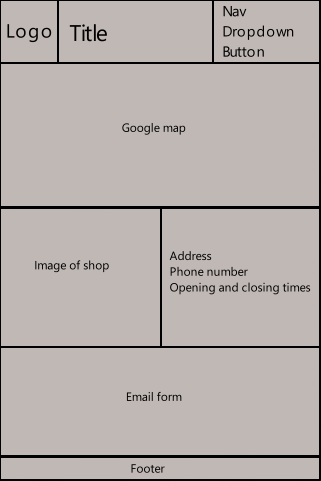

<h4>Tablet wireframes</h4>

<h4>Computer wireframe</h4>

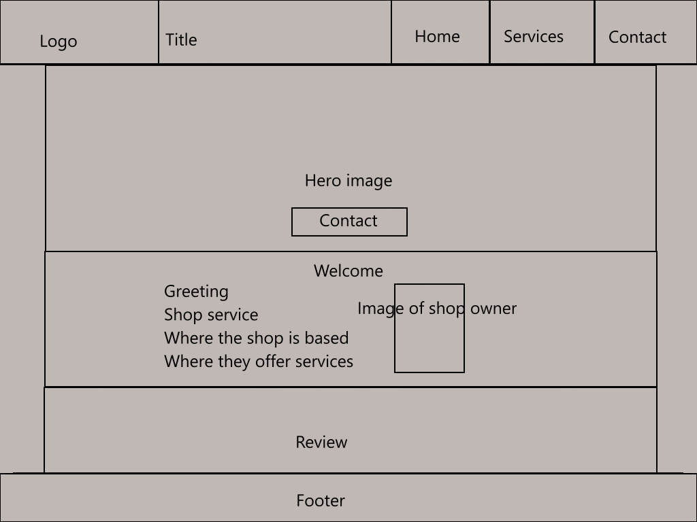

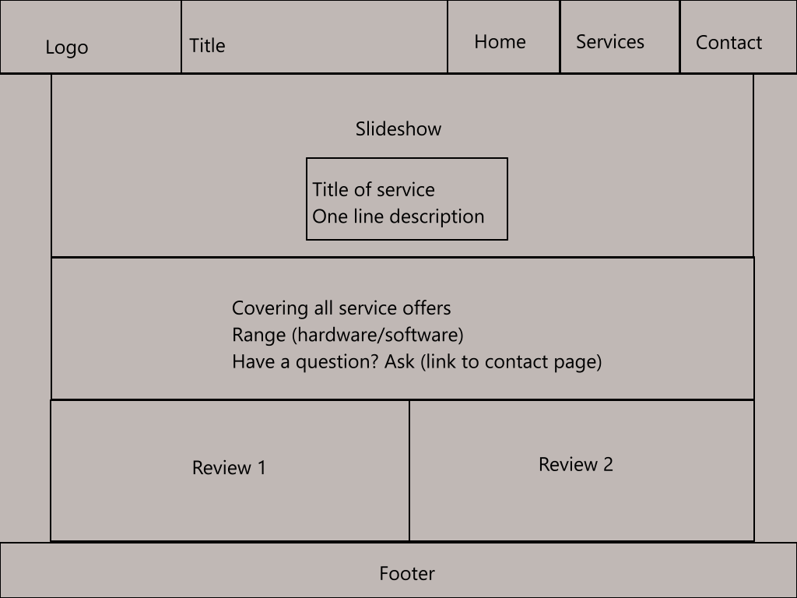

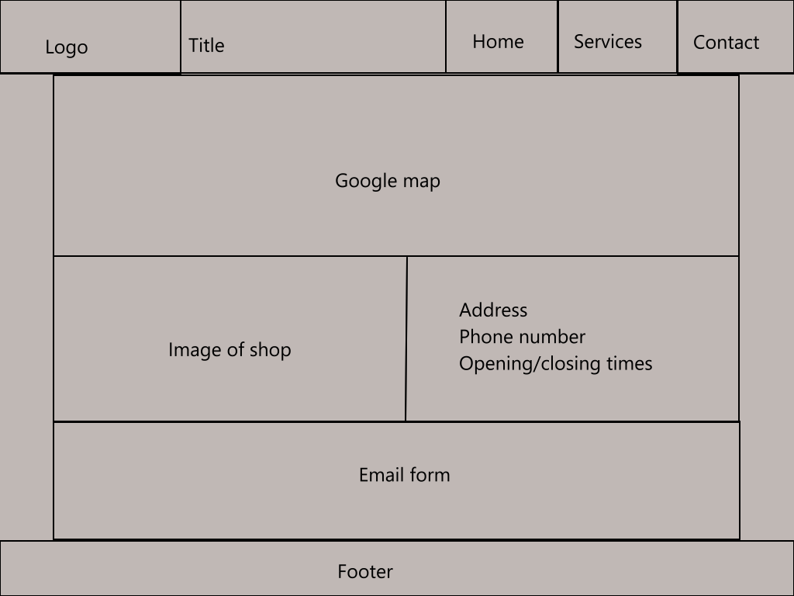

<h4>Navigation</h4>

The navigation will use bold colours and hard blocks to stand out on the page.

<h4>Footer</h4>

It will mirror the colours and blockiness of the navigation, yet will keep itself simple to avoid drawing the user's attention away from the page's content.

<h4>Landing page</h4>

The landing page will have a large hero element to draw the user's attention to it, where they will find the store's phone number. This is for both returning users and new users. Returning users are likely already sold on the service and want to simply contact the store as quickly as possible. For new users, this is to immediately put the information of where the shop's number is, so if they're convinced already on the welcome directly below they can immediately use it without having to search for it. Alternatively, new users might have been recommended by a friend, and as such will already be sold on the service and will want to be able to call the store for further questions as quickly as possible.

Below the hero image will be a brief welcome and the shop owner's image. The purpose of these is to quickly create a friendly, honest atmosphere for the user. The welcome message will also briefly state what the store does and where it offers its services.

At the bottom will be a review, to once again help create a sensation of trust from the website and the store's services.

<h4>Services page</h4>

Once again a large hero-like image takes the front and centre to keep consistency across the pages. This hero image is a carousel whose purpose is to briefly and quickly explain the services the store offers.

The second section below it is meant to expand on this and explain in greater detail what the shop does and the services it provides.

The reviews are again there to create a feeling of trust with the user for the store.

<h4>Contact page</h4>

A large iframe embed of a Google Map mimics the hero image and carousel of the other two pages. The purpose of it is to simply show exactly where the store is on a map.

Below it is another image of the store and a table of open/closed times during the week, an address, and a phone number again. The image is the same one as the hero image but without a grey background darkening it, and the purpose of it is to present what the store looks like from the street for those looking for it. The address is physically typed out as a redundancy in case the user has any problems with Google Maps. The open and closed times during the week are to inform the user when they can call/enter the store.

Finally, the form is there for those who wish to email the store, in case they wish to message the store but don't have a phone and/or the store is closed at the time, without having to copy/paste an email address and leave the site to do so.

<h3>Colour</h3>

Using the logo of the shop (posted above), the main colours shall be white, dark blue, and bright yellow.

For contrast and easy readability, a white background with standard black text is used. The yellow was a great choice for anything related to links or contacting the store, due to the colour theory of yellow representing "purchase" or "service". Dark blue and white have a great contrast, thus would work great for the header/footer to make it stand out from the page's content.

<h3>Content</h3>

Most people using the website will not be tech literate, and seeing how they're looking for computer support for one reason or another, will likely not be using their computer and instead mobile devices. As such, content needs to be small and easy to navigate, with the language used to explain topics kept as simple as possible. Every piece of content should fill a role: explaining the store, explaining the services, and explaining how to contact the store.

<h2 align="center">End result</h2>

<h3>Current features</h3>

<h4>Nav bar</h4>

-Simple design that keeps itself bold via strong contrast and harsh lines

-Not crowded

-Links change colour to match the page the user is on, preventing themselves from getting lost

-Stands out from the page content 

<h4>Footer</h4>

-Bold and minimal design doesn't draw attention away from content yet clearly blocks out where it ends

-The Facebook logo is the largest and clearest part of the footer in case anyone does look into the footer for links to social media

-Backup links to all pages if the nav bar stops working for whatever reason

-Clearly states legal rights

<h4>Index hero</h4>

-The image is large enough to grab users attention but the slightly darkened tone prevents it being too obnoxious

-The contact/phone number having a full hue with strongly contrasting text colours draws the eye to it

-The background image of the store sign already plants an image of the store in the user's mind, as well as listing services the store provides

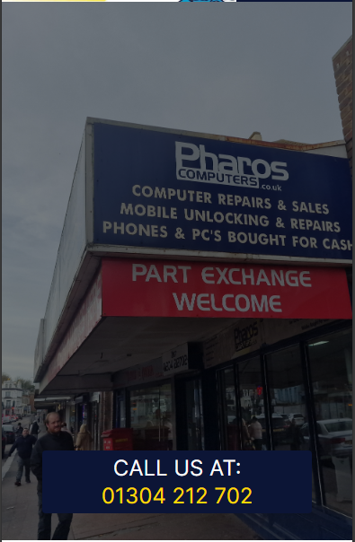

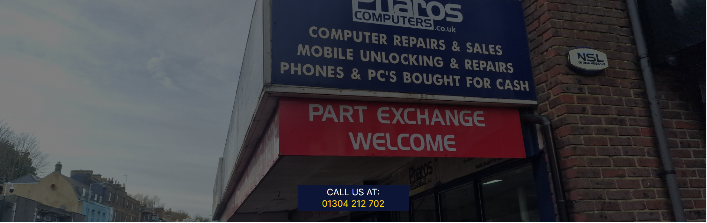

<h4>Index welcome</h4>

-The image of the shop owner helps create a sense of trust, a face to put the shop/brand to

-Welcome text gets straight to the point in explaining what the store is and where they can provide services.

-Adaptive to different screen sizes

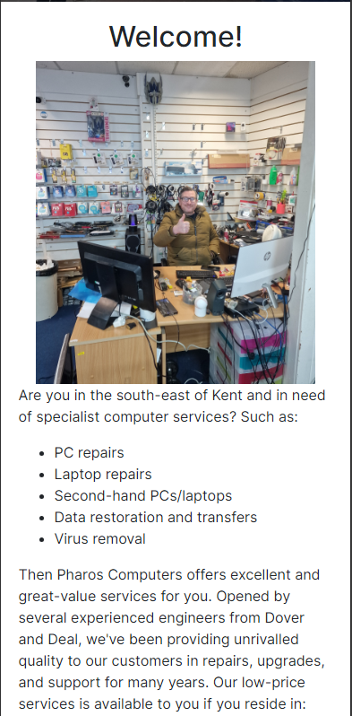

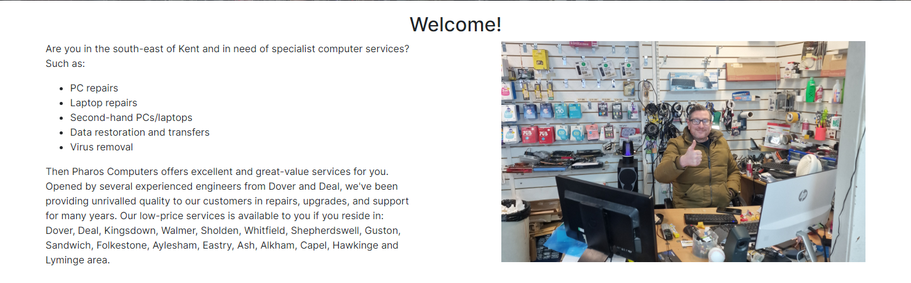

<h4>Index review</h4>

-Short and brief

-Grey background and message icon make it stand out from the rest of the content and mark it as a quote

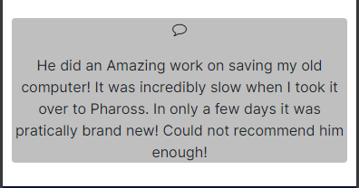

<h4>Services carousel</h4>

-Smooth transitions

-Explanations are brief and to the point

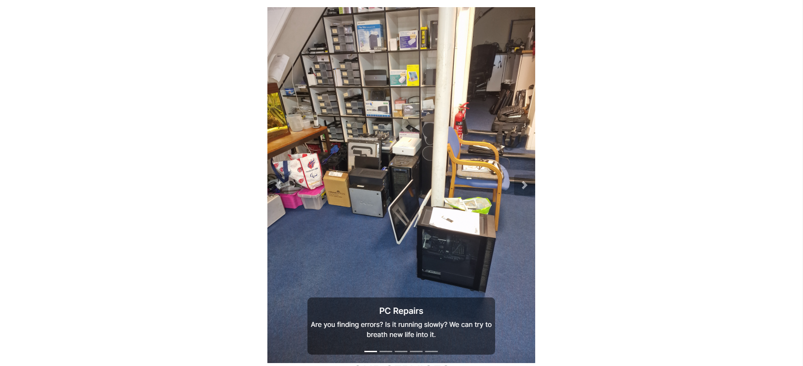

<h4>Services info</h4>

-Buttons break the content down from being a large page of text into easily comprehensible text

-Buttons reduce the scrolling it would take to find content

<h4>Services reviews</h4>

-Grey background and message icon make it stand out from the rest of the content and mark it as a quote

-Reviews adapt to different screen sizes

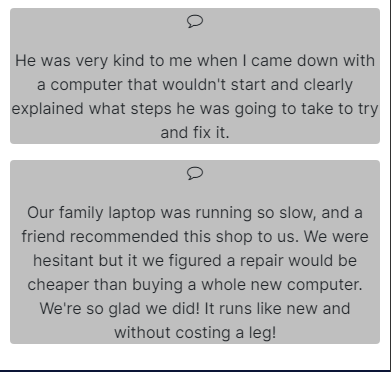

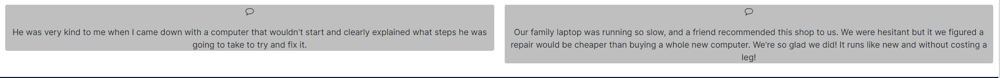

<h4>Contact google map</h4>

-Large yet seamlessly fits into the page

-Access to other reviews

-Keeps the consistency of having a large block as the first element on the page

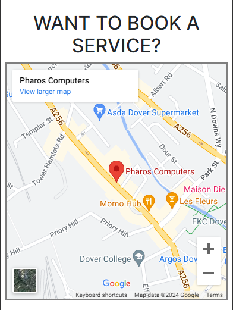

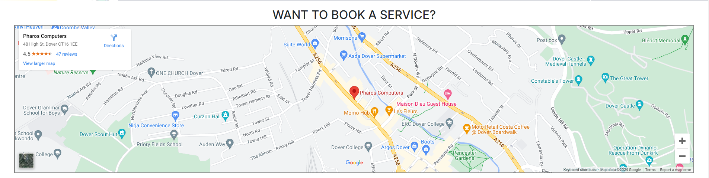

<h4>Contact shop photo, address, and timetable</h4>

-Reusing the hero image from the index page helps solidify the image of the store in the user's mind

-Address is clear and easy to read

-Opening times clearly state when the store opens and closes on what day

-Telephone is in bold to draw the user's attention to it and break up the dullness of the address section

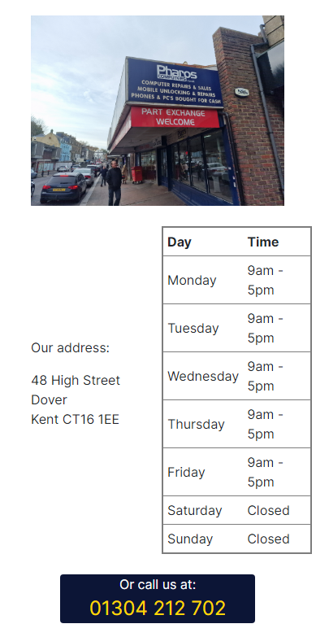

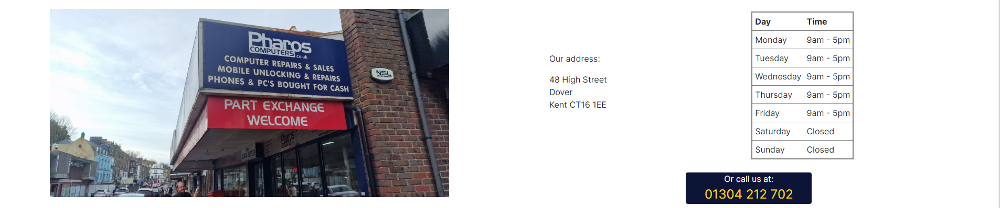

<h4>Contact form</h4>

-Works on sending a form to the Code Institute dump form

-Name, email, and message are working required checks

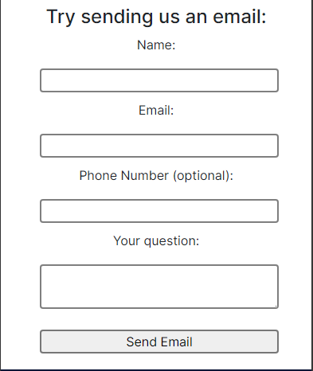

<h3>Future development/Future features</h3>

Plans for future features/changes I would add if I were to have the time to do so in the future.

Navigation bar:

-Make the h1 title of Pharos Computers a link that links back to the landing/index page

Index hero:

-Change the phone number/contact link instead to a 'learn more' button that links to the services page

Services carousel:

-Have each carousel caption have a link/button that opens up its corresponding info in the services extended section

-Have each carousel image be a different image related to the topic it is talking about

<h2 align="center">Technology used</h2>

<h3>Languages used</h3>

Html5

CSS3

<h3>Frameworks, Libraries & Programs Used</h3>

[Bootstrap 4.2.1:](https://getbootstrap.com/docs/4.2/getting-started/introduction/)

-Used for screen responsiveness across the website, as well as the dropdown menu for small screens and the carousel on the services page

[jQuery:](https://jquery.com/)

-Used by Bootstrap to make the interactive elements of the navbar dropdown on small screens and the carousel on the services page

[FontAwesome:](https://fontawesome.com/v4/icons/)

-Used for the Facebook icon in the footer and icon in the navbar for small screens.

[Google Fonts:](https://fonts.google.com/)

-Used for the font "inter" across the website

[Git](https://git-scm.com/)

-Used for version control by utilising the Gitpod terminal to commit to Git and Push to GitHub.

[Github](https://github.com/)

-Used to store the project's code

<h2 align="center">Testing</h2>

<h3>During development/bug fixing</h3>

<h4>Nav section on large screens</h4>

On the planned wireframe I had the navigation on large screens to be three links split horizontally, however, I encountered a problem with this. The col-2 spacing did not leave a lot of room. On a standard widescreen, this was not a problem, but when the screen width shrunk down the words would end up overlaying one another before it would switch to the dropdown button for small screens. See the images below.

Old lg nav (right side) on normal full-width screen:

Old lg nav (right side) on a screen with a smaller than standard width:

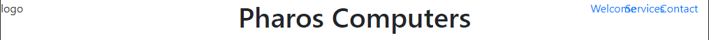

I, therefore, decided to keep accessibility across different screen sizes to layer the three navigation links vertically instead of horizontally.

New lg nav (right side) on normal full-width screen:

New lg nav (right side) on a screen with a smaller than standard width:

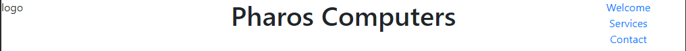

<h4>Logo on small screens</h4>

On the planned wireframe for small devices, I had planned for the: logo, header/title, and nav bar to all fit in the navigation bar. I was hesitant due to the size of the logo if it would end up being squished, however, and was hoping to see if reducing the size of the navigation menu would allow it to fit. The dropdown menu was not enough though and the logo does end up being squished and/or offscreen on small screens.

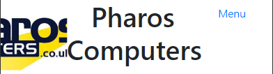

This also raised another problem. With the logo and website header/title in front of me, I could see the redundancy of the business name appearing in both the logo and the header.

This led to me deciding to remove the title/header on mobile to remove redundancy and create room for the logo.

<h2 align="center">Deployment</h2>

<h3>Validator testing</h3>

<h4>HTML</h4>
No errors when passing through the official W3C validator for any of the three pages.

[Index](https://validator.w3.org/nu/?doc=https%3A%2F%2Fconnorfriday-code.github.io%2FPharos-Computers%2Findex.html)

[Services](https://validator.w3.org/nu/?doc=https%3A%2F%2Fconnorfriday-code.github.io%2FPharos-Computers%2Fservices.html)

[Contact](https://validator.w3.org/nu/?doc=https%3A%2F%2Fconnorfriday-code.github.io%2FPharos-Computers%2Fcontact.html)

<h4>CSS</h4>

No errors when passing through the official W3 jigsaw validator. The warnings are only from bootstrap/fontawesome.

[CSS](https://jigsaw.w3.org/css-validator/validator?uri=https%3A%2F%2Fconnorfriday-code.github.io%2FPharos-Computers%2Fcontact.html&profile=css3svg&usermedium=all&warning=1&vextwarning=&lang=en)

<h3>Lighthouse testing</h3>

<H4>Index page</H4>

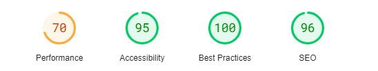

<H4>Services page</H4>

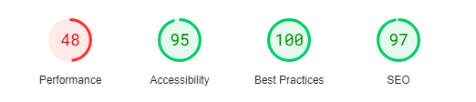

<H4>Contact page</H4>

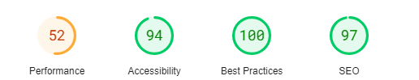

<h4>Performance</h4>

The largest reason why performance in all three lighthouse pages is low is due to images being excessively large and increasing load times. It is noted in the bugs/future development to resize the images to decrease load time.

<h3>User stories</h3>

Confirming I have met the target goal experiences I have set out first time and returning users.

<h4>User first time goals:</h4>

a. To quickly learn the purpose/service of the website/shop

- Website title/header mentions computers

- Hero image on index/landing page lists computer services

- Index/landing page brief welcome explains the purpose of the shop

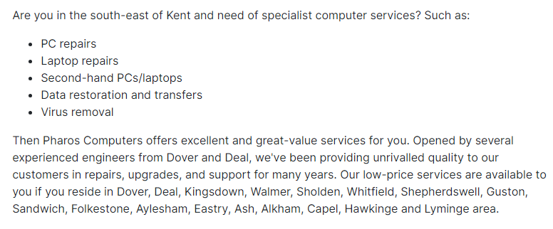

b. To have the services clearly and simply explained, and that the owner of the shop values my time.

- Welcome message on index page quickly explains services
 
- Links and the pages are clear in explaining what they're about so as to not waste the user's time

- Service page has all offers listed, with each offer being broken down into compartments with buttons and being no more than a paragraph long

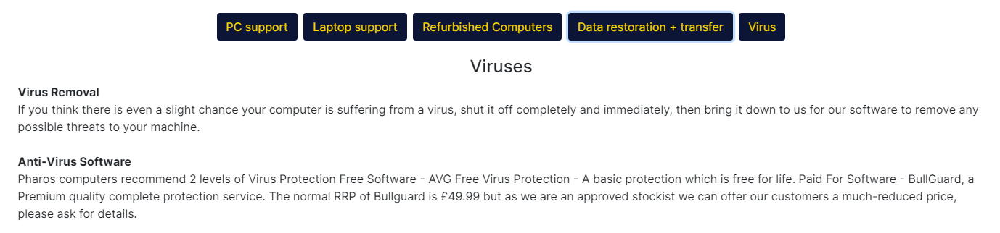

c. To be assured that services provided are both good quality and good value

- Google map and images of the shop prove the shop is both real and a legitimate business

- Reviews provide assurance to good quality

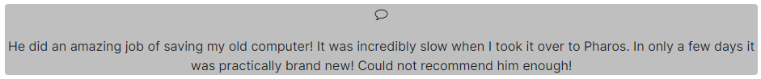

d. To be quickly directed to contact details if they're sold on the service

- The contact page is easy to find in navigation

- Index page's hero image has a phone number in the middle

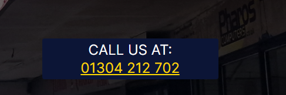

<h4>Returning user goals:</h4>

a. For contact details to be quickly presented to me

- Index page's hero image contains the shop’s phone number

- Contact page easy to navigate to

b. For other services to be quickly readable if I need them

- Services listed all on one page

- Services are split up with buttons for quicker and easier navigation

<h4>Frequent user goals:</h4>

a. For quick loading times

- Pages load at an acceptable speed

b. Contact information to be available to me swiftly

- The index page's hero image contains a phone number

- The contact page is easy to navigate to

- various forms of contact are available

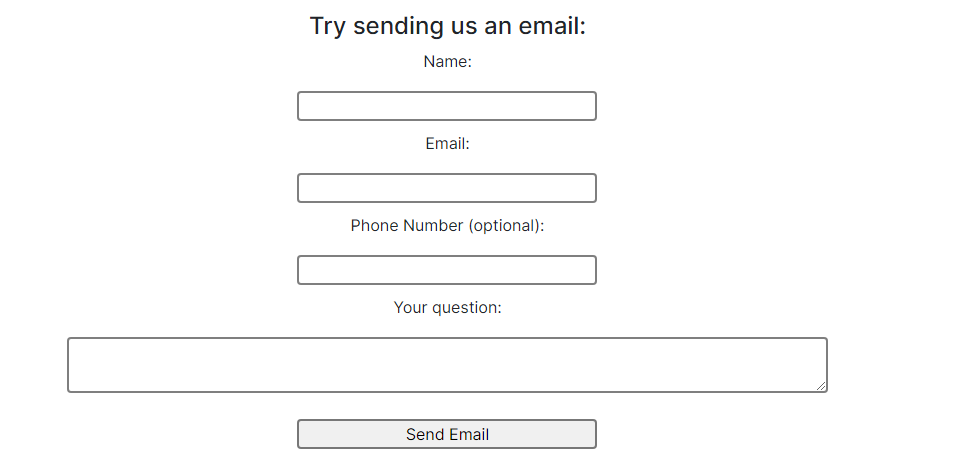

<h3>Git</h3>

The site was deployed to GitHub pages through the steps as follows:

<ol>
<li>In the GitHub repository is the settings tab</li>
<li>In the new page there will be a menu on the left with one option being 'Pages'</li>
<li>Within this I selected the branch to be 'Main', and refreshing the page a minute later it had updated with a ribbon display to indicate success</li>
</ol>

The live link can be found here: [Live project](https://connorfriday-code.github.io/Pharos-Computers/)

<h2 align="center">Credits</h2>

<h3>Code</h3>

[Bootstrap 4.2.1:](https://getbootstrap.com/docs/4.2/getting-started/introduction/): Bootstrap Library to make my website responsive to different screen sizes using the grid method, for dropdown menu on small screens, and the carousel in services.

[W3Validator](https://validator.w3.org/): For validating the HTML of my three pages and offering corrections to be made.

[W3Jigsaw](https://jigsaw.w3.org/css-validator/): For vailidating the HTML of my CSS.

<h3>Content</h3>

All content was written by me.

<h3>Media</h3>

Media images were taken by me

The logo belongs to Pharos Computers and all rights belong to them

<h3>Acknowledgements</h3>

My mentor for providing me with helpful advice throughout the project.

Code Institute for teaching me the knowledge of web development and providing a library of resources to return to for help