<h1 align="center">Pharos Computers</h1>

Pharos Computers is a website based on a real shop in my local town, with the goal to spread information about its services and direct customers towards the shop. It is designed to be readable on all types of media, with the desgin subtly changing to match the different widths of different devices. The content will be fairly simple and describe problems in broad terms. Not only is this to keep text-bloat as small as possible to increase readability, but if a customer is looking for technical help for their computer, then chances are technical terms will only confuse and deter them.

The owner of the shop has given me permission to make a website based on his shop.
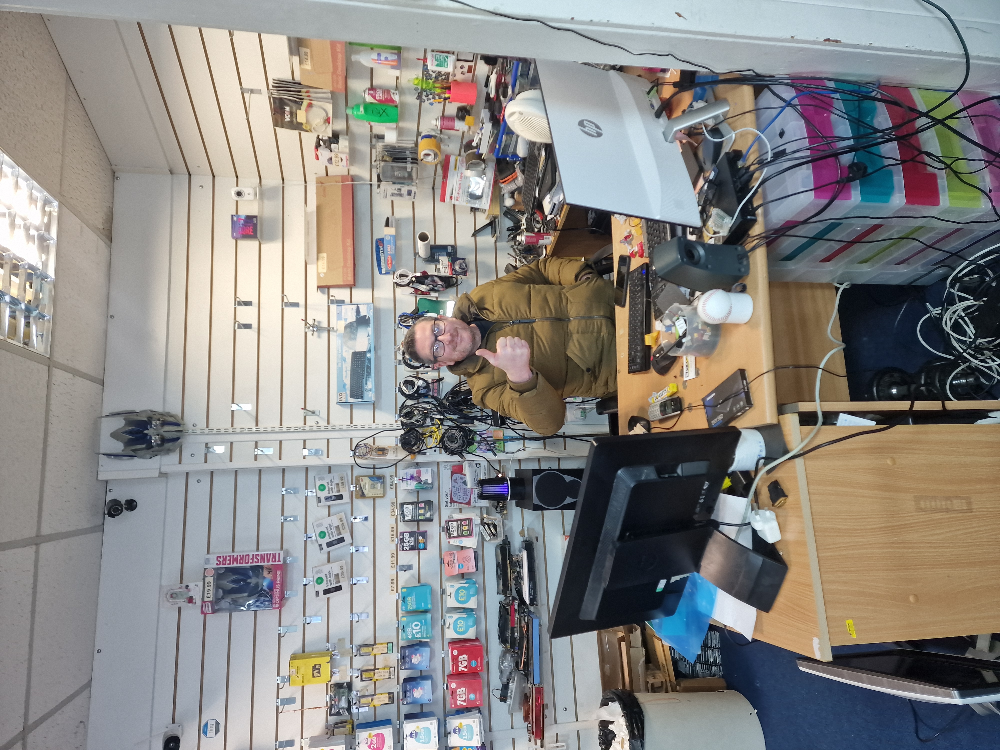

<h2 align="center">User Experience/UX</h2>

<h3>User stories/goals</h3>

<h4>User first time goals:</h4>

a. To quickly learn the purpose/service of the website/shop

b. To have the services clearly and simply explained, and that owner of the shop values my time.

c. To be assured that services provided is both good quality and good value

d. To be quickly directed to contact details if they're sold on the service

<h4>Returning user goals:</h4>

a. For contact details to be quickly presented to me

b. For other services to be quickly readable if I need them

<h4>Frequent user goals:</h4>

a. For quick loading times

b. Contact information to be avaible to me swiftly

<h2 align="center">Design</h2>

<h3>Layout</h3>

The layout will be simple to keep readers on track. Using clear content blocks and colours, I can direct a customers eyes to contact details and service information.

<h3>Features</h3>
The website needs to be adaptive to different screen sizes.

The website needs to be quick to navigate.

It needs to have a functioning form section.

The website needs to be as accessible as possible to those with disabilities.

<h3>Wireframes</h3>

<h4>Phone wireframes</h4>

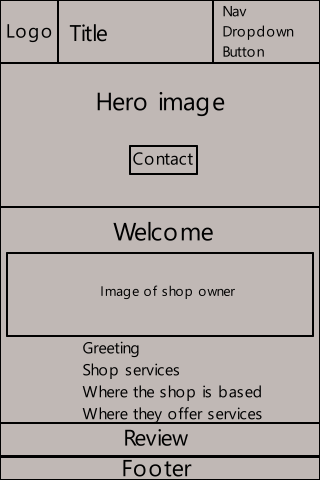

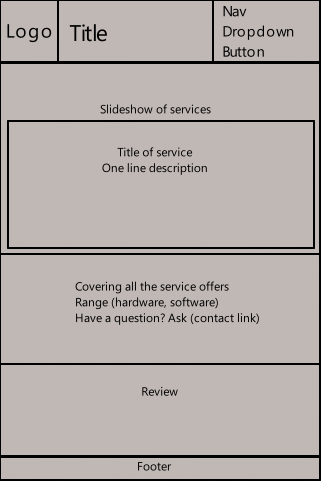

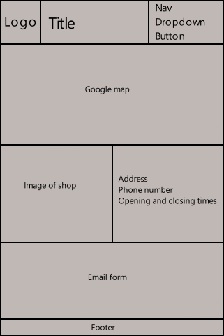

<h4>Tablet wireframes</h4>

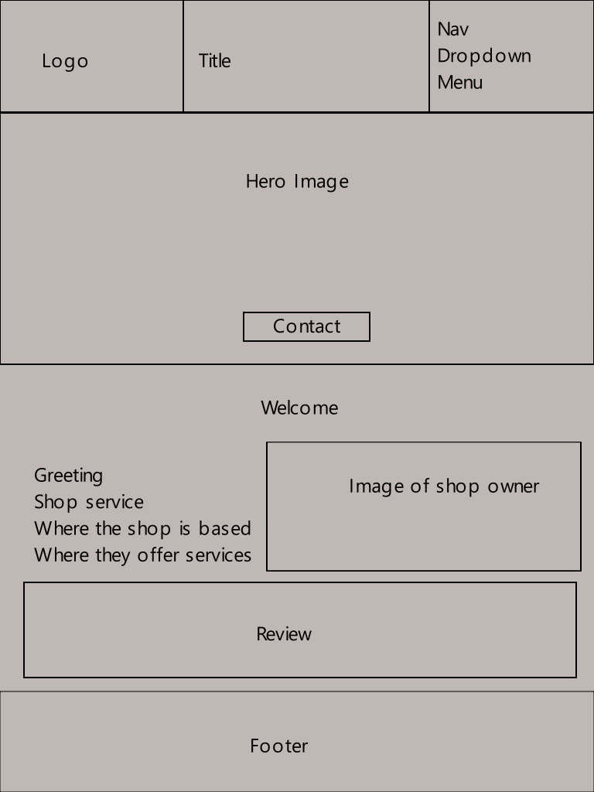

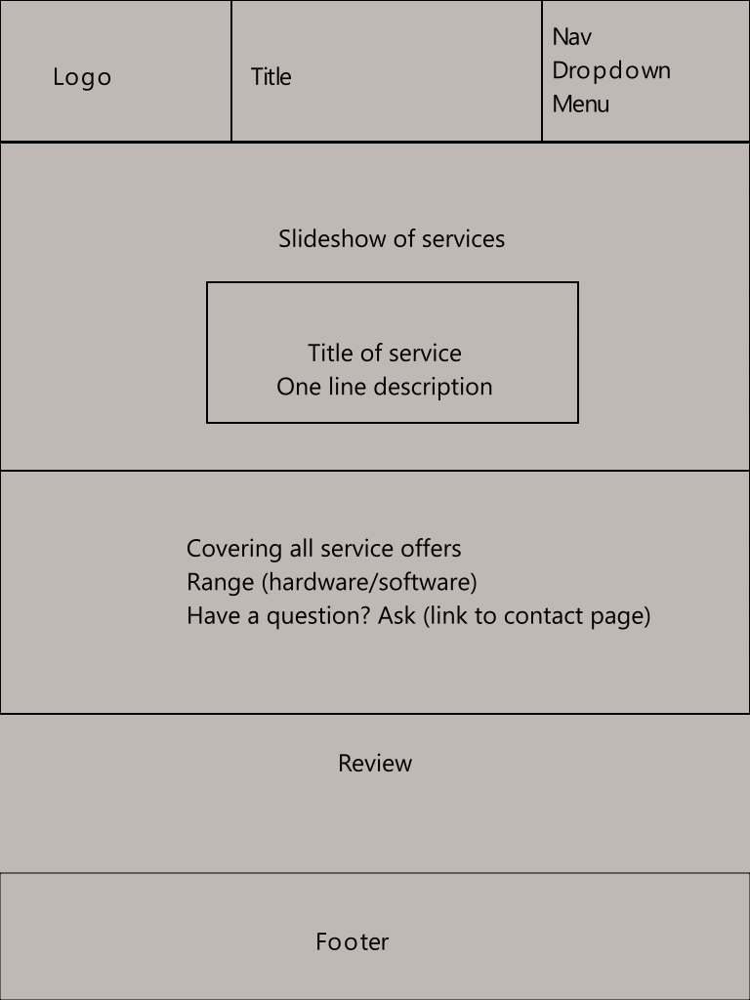

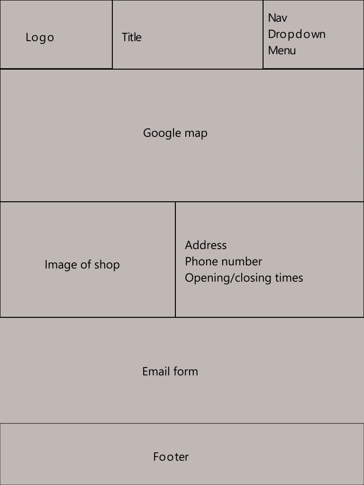

<h4>Computer wireframe</h4>

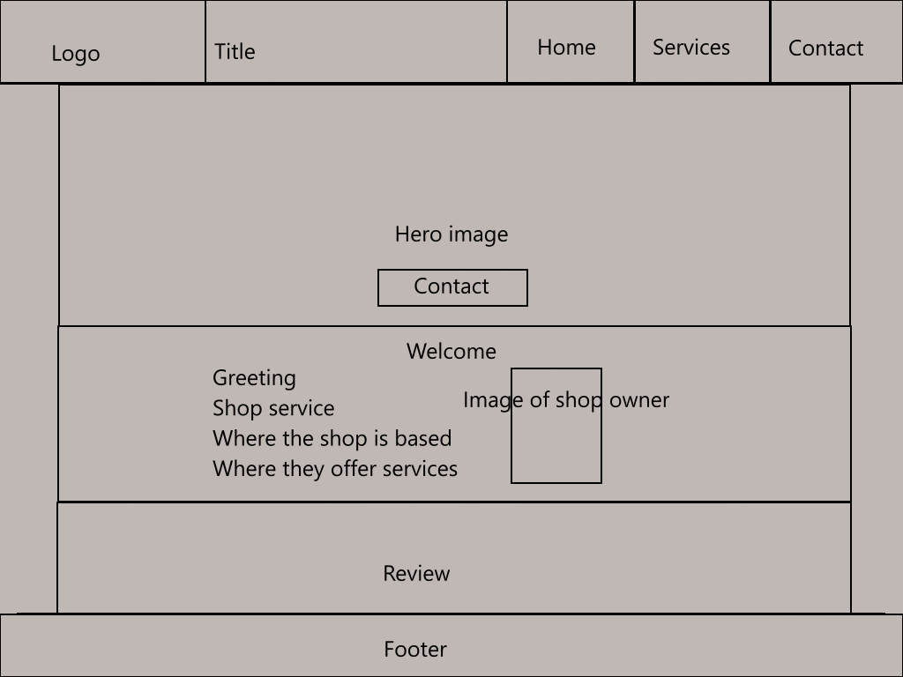

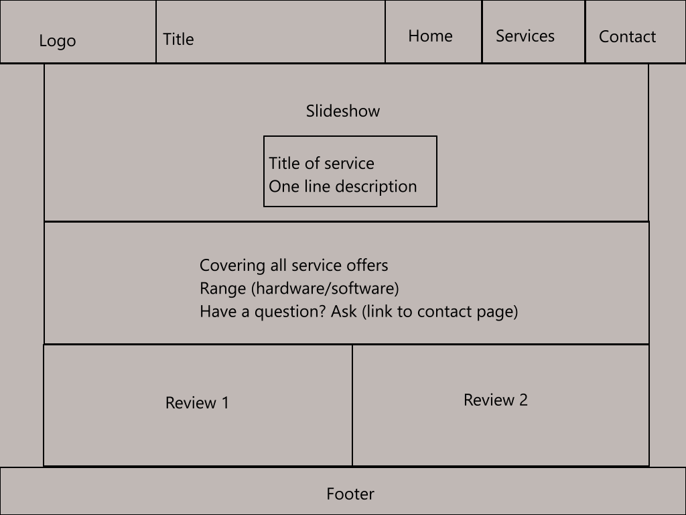

<h4>Navigation</h4>

The navgation will use bold colours and hard blocks to stand out on the page.

<h4>Footer</h4>

It will mirror the colours and blockiness of the navigation, yet will keep itself simple to not draw the user's attention away from the pages content.

<h4>Landing page</h4>

The landing page will have a large hero element to draw the user's attention to it, where they will find the store's phone number. This is for both returning users and new users. For returning users, they are likely already sold on the service and want to simply contact the store as quick as possible. For new users, this is to immediately put the information of where the shop's number is, so if they're sold already on the welcome directly below they can immediately use it without having to search for. Alternatively, new users might have been recommended by a friend, and as such will already be sold on the service and will want to be able call the store for further questions as quickly as possible.

Below the hero image will be a brief welcome and the shop owner's image. The purpose of these is to quickly create a friendly, honest atmosphere to the user. The welcome message will also briefly state what the store does and where they offer their services to.

At the bottom will be a review, to once again help create a sensation of trust from the website and the store's services.

<h4>Services page</h4>

Once again a large hero-like image takes the front and centre to keep consistency across the pages. This hero image is actually a carousel who's purpose is to briefly and quickly explain the services the store offers.

The second section below it is meant to expand on this and explain in greater detail what the shop does and the services it provides.

The reviews are again there to create a feeling of trust with the user for the store.

<h4>Contact page</h4>

A large iframe embed of a google map mimics the hero image and carousel of the other two pages. The purpose of it is to simply show exactly where the store is on a map.

Below it is another image of the store and table of open/closed times during the week, an address, and a phone number again. The image is the same one as the hero image but without a grey background darkening it, and the purpose of it is to present what the store looks like from the street for those looking for it. The address is physically typed out as a redundancy in case the user has any problems with the google map. The open and closed time during the week is to inform the user when they can call/enter the store.

Finally the form is there for those who wish to email the store, in case they wish to message the store but don't have a phone and/or the store is closed at the time, without having to copy/paste an email address and leave the site to do so.

<h3>Colour</h3>

Using the logo of the shop (posted above), the main colours shall be: white, dark blue, and bright yellow.
For contrast and easy readability, a white background with standard black/charcol coloured text is used. The yellow was a great choice for anything related to links or contacting the store, due to the standard colour theory of yellow meaning "purchase" or "service". Dark blue and white have a great contrast, thus would work great for the header/footer to make it stand out from the page's content.

<h3>Content</h3>

Most people using the website will not be tech literate, and seeing how they're looking for computer support for one reason or another, will likely not be using their computer and instead mobile devices. As such, content needs to be small and easy to navigate, with the language used to explain topics kept as simple as possible. Every piece of content should fill a role: explaining the store, explaining the services, and explaining how to contact the store.

<h2 align="center">End result</h2>

<h3>Current features</h3>

<h4>Nav bar</h4>

-Simple design that keeps itself bold via strong contrast and harsh lines

-Not crowded

-Links change colour to match the page the user is on, preventing themselves from getting lost

-Stands out from the pages content 

<h4>Footer</h4>

-Bold and minimal design, doesn't draw attention away from content yet cleary blocks out where it ends

-Facebook logo is the largest and clearest part of the footer in case anyone does look into the footer for links to social media

-Backup links to all pages if the nav bar stops working for whatever reason

-Clearly states legal rights

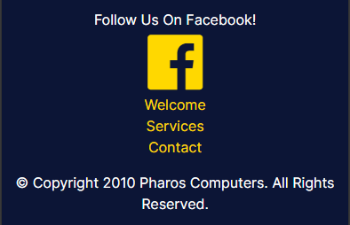

<h4>Index hero</h4>

-Image is large enough to grab users attention but the slightly darkened tone prevents it being too obnoxious

-The contact/phone number having full hue draws the eye to it

-The background image being of the store sign already plants a image of the store in the users mind, as well as listing services the store provides

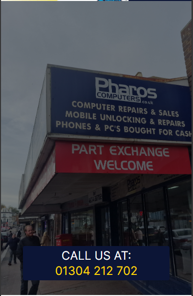

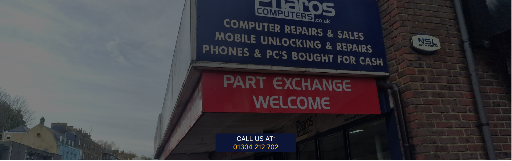

<h4>Index welcome</h4>

-Image of shop owner helps create a sense of trust, a face to put the shop/brand to

-Welcome text gets straight to the point in explaining what the store is and where they can provide services.

-Adaptive to different screen sizes

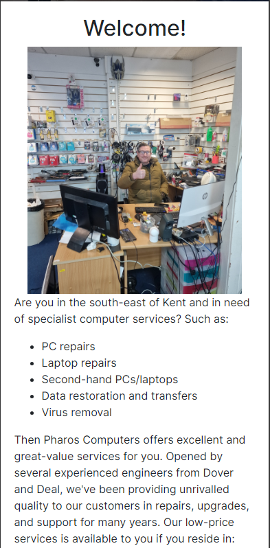

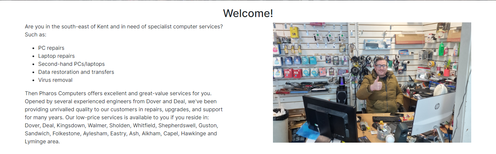

<h4>Index review</h4>

-Short and brief

-Grey background and message icon makes it stand out from the rest of the content and mark it as a quote

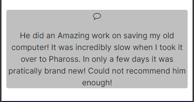

<h4>Services carousel</h4>

-Smooth transitions

-Explanations are brief and to the point

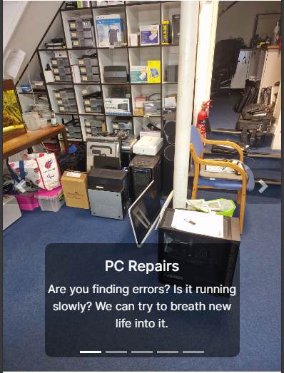

<h4>Services info</h4>

-Buttons break the content down from being a large page of text down into easily comprehensible text

-Buttons reduces the scrolling it would take to find content

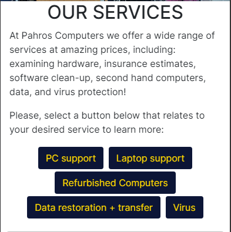

<h4>Services reviews</h4>

-Grey background and message icon makes it stand out from the rest of the content and mark it as a quote

-Reviews adapt to different screen sizes

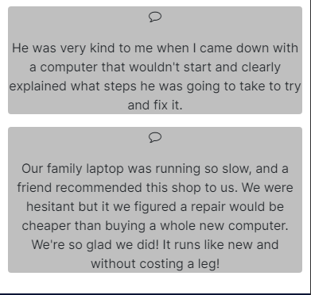

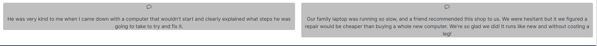

<h4>Contact google map</h4>

-Large yet seamlessly fits into page

-Access to other reviews

-Keeps the consistency of having a large block as the first element on the page

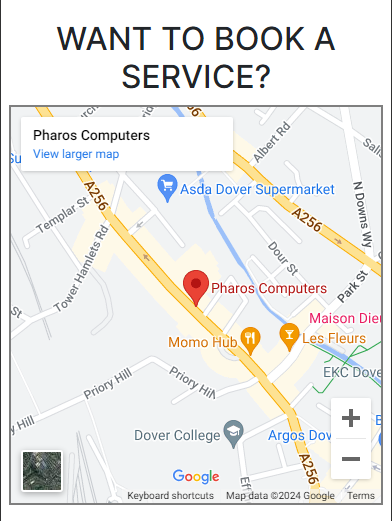

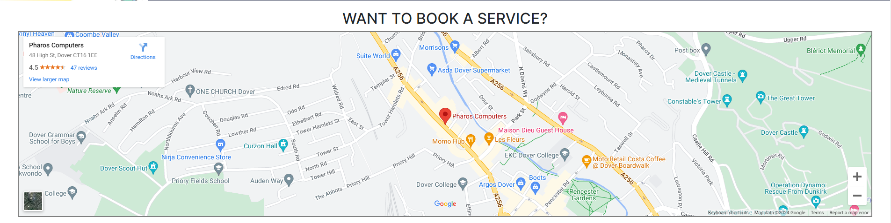

<h4>Contact shop photo, address, and timetable</h4>

-Repeating the image from the hero-image on index page help solidfies image of store in the user's mind

-Address is clear and easy to read

-Opening times cleary state when the store opens and closes on what day

-Telephone is in bold to draw user's attention to it and break up the dullness of address section

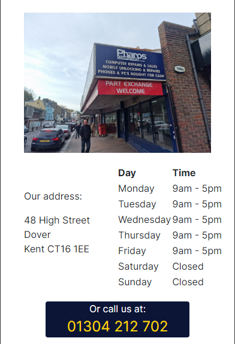

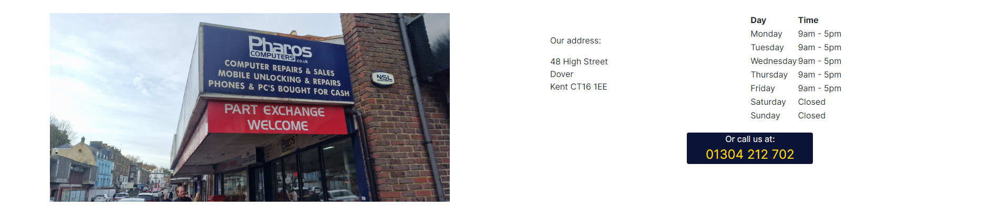

<h4>Contact form</h4>

-Works in sending a form to code institute

-Name, email, and message are working required checks

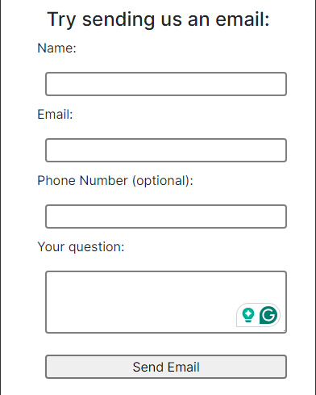

<h3>Future development</h3>

<h2>Technology used</h2>

<h3>Languages used</h3>

Html5

CSS3

<h3>Frameworks, Libraries & Programs Used</h3>

[Bootstrap 4.2.1:](https://getbootstrap.com/docs/4.2/getting-started/introduction/)

[jQuery:](https://jquery.com/)

[FontAwesome:](https://fontawesome.com/v4/icons/)

[Google Fonts:](https://fonts.google.com/)

[Git](https://git-scm.com/)

[Github](https://github.com/)

<h2>Testing</h2>

<h3>During development</h3>

<h4>Nav section on large screens</h4>

On the planned wireframe I had the navigation on large screens to be three links split horizontally, however, I encounted a problem with this. The col-2 spacing did not leave a lot of room. On standard wide screen this was not a problem, but when the screen width shrunk down, the words would end up overlaying one another before it would switch to the dropdown button for small screens. See images below.

Old lg nav (right side) on normal full width screen:

Old lg nav (right side) on a screen with a smaller than standard width:

I, therefore, decided to keep accessability across different screen sizes to layer the three navigation links vertically instead of horizontally.

New lg nav (right side) on on normal full width screen:

New lg nav (right side) on a screen with smaller than standard width:

<h4>Logo on small screens</h4>

On the planned wireframe for small devices, I had planned for the: logo, header/title, and nav bar to all fit in the navigation bar. I was hesistant due to the size of the logo if it would end up being squished, however, and was hoping to see if reducing the size of the navigation menu would allow it to fit. The dropdown menu was not enough though and the logo does end up being squished, overlaying, and/or offscreen on small screens.

This also raised another problem. With the logo and website header/title in front of me, I could see the redundency of the buisness name appearing in both the logo and in the header.

This led me to deciding to remove the title/header on mobile to remove redundency and create room for the logo.

<h2>Deployment</h2>

<h2>Credits</h2>

<h3>Centralise div</h3>

Thank you to Matthias Weiler for the code to centralise the contact "call us" square on the hero image (index.html)

[His code is found here](https://stackoverflow.com/questions/1776915/how-can-i-center-an-absolutely-positioned-element-in-a-div)

<h3>Code</h3>
<h3>Content</h3>
<h3>Media</h3>
<h3>Acknowledgements</h3>